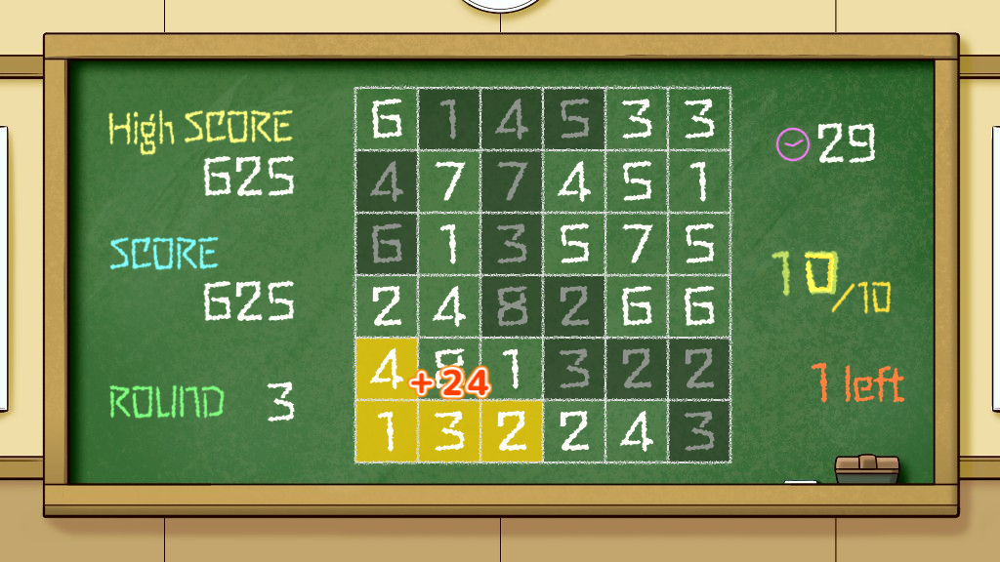

# 足し算パズル「たしてっ10(テン)」

ニコ生ゲーム対応のパズルゲーム( https://namagame.coe.nicovideo.jp/games/lg12618 )です。  
Akashic Engine( https://akashic-games.github.io/tutorial/v3/ )で制作されています。



## 利用方法

「Akashic Engine 入門」の「akashic 導入」( https://akashic-games.github.io/tutorial/v3/introduction.html#akashic-%E5%B0%8E%E5%85%A5 )を参考に、開発環境を構築してください。

本リポジトリをクローン後、以下のコマンドでビルドします。

```sh
npm install
npm run build
```

次のコマンドで akashic-sandbox が起動されます。  
起動後、ブラウザで `http://localhost:3000/` にアクセスすることでゲームを実行できます。

```sh
npm start
```

「TypeScript での開発」の「必要ライブラリのインストール」( https://akashic-games.github.io/tutorial/v3/typescript.html#npm-install )以降を参考にしてください。


## ライセンス

このプロジェクトのソースコードは MIT License の元で公開されています。詳しくは [LICENSE](./LICENSE) をご覧ください。

次の方々の素材を基にしたアセットについては、それぞれのリンク先のライセンスをご確認ください。

GOROU さん (https://commons.nicovideo.jp/works/nc297111)  
ふぉんときゅーとがーる さん (https://font.cutegirl.jp/chalk-s.html)  
にゃっき♭ さん (https://commons.nicovideo.jp/works/nc262131)  
G-MIYA さん (https://commons.nicovideo.jp/works/nc129782)  

